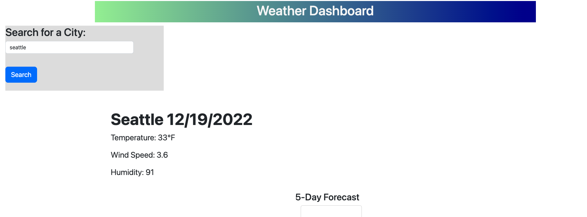

# WhatistheWeatherlike-

## Description 

Create a simple Weather Dashboard for user to check weather of the cities they have input in the search bar. By using the openweather api, it'll fetch the cities that the user is searching for. It will give the user the current day weather and the next 5 day weather too. Each day will display the city, temperature, wind speed, and humidity.

## Images

The user can see that the landing page are on the page for checking the weather.

Once the users input the city they want to get the weather for. It'll display the current day and 5 days. It'll show the city, temperature, wind speed, and humidity.

## Website